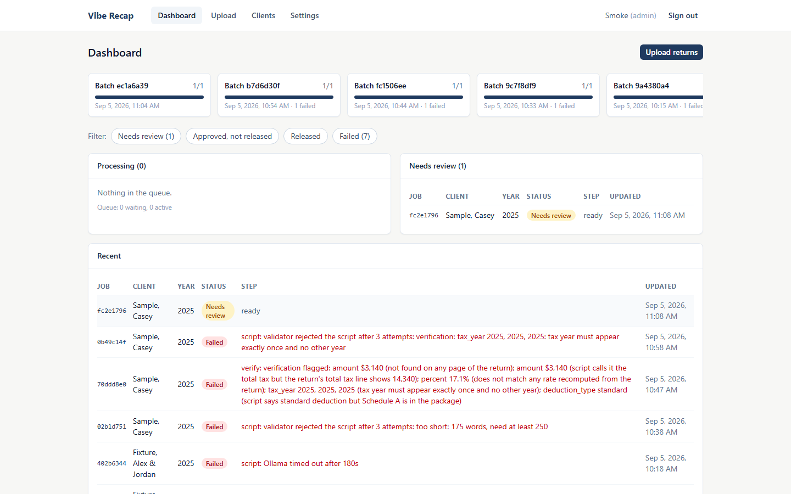
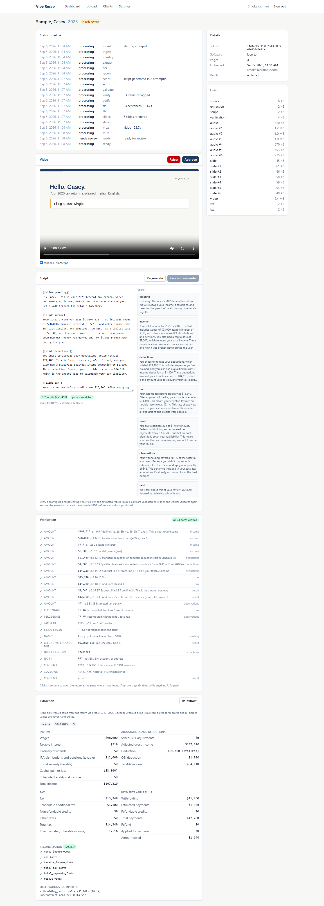

# Vibe Recap

Self-hosted appliance for CPA firms. A preparer uploads a finished Form 1040 package (PDF from
UltraTax, Lacerte, CCH Axcess, GoSystem, Drake, or ProSeries); Recap extracts the figures,
writes a plain-English narrated video summary for the client, and lets the preparer review,
approve, and download it for delivery through the firm's own channel.

Everything runs on the firm's own hardware, and the worker that reads returns has no internet
route. The return itself never leaves the box. Script generation goes through the Vibe AI Router
by default, which sends only the extracted figures and first names to the firm's configured
models under the router's data-boundary policy; the bundled local model remains a switch away.



## What happens to a return

```
upload → identify → extract → recon gate → script (local LLM) → validate → verify → narrate → slides → video → review → approve → release → download
```

- **Extraction is data-driven.** Form profiles (YAML) map line labels to the schema per software.
  Extracted values are never hand-edited; if a line is misread, the profile is fixed and the return
  re-extracted.
- **Two hard gates before any audio.** The validator rejects any dollar figure or percentage in the
  script that does not exist in the extracted JSON. The verifier then re-reads the uploaded PDF on
  its own and traces every amount and fact in the script to a page and line of the return.
- **Changes by instruction.** A preparer can ask for changes in plain English on the job page;
  the script is rewritten with that instruction and runs through the same gates again. A rewrite
  that fails them leaves the previous script and video in place.
- **Preparer approval before release.** Approve snapshots the script, the extraction, and the
  verification. Delivery is download only: MP4, captions, transcript, or one ZIP.
- **Retention is a job, not a promise.** An hourly purge is the only thing that deletes files, and
  every deletion is in the audit log.



## Quick start

```bash
cp .env.example .env            # set POSTGRES_PASSWORD; pick TLS_MODE
docker compose up -d
```

Open `https://<host>/`, create the first administrator, and upload a return. The full guide,
including Tailscale and public-domain TLS, host Ollama, backups, and troubleshooting, is
[`docs/INSTALL.md`](docs/INSTALL.md).

Reference hardware: a GMKtec NucBox M6 (Ryzen 5 6600H, 32 GB). Model inference is CPU only.

## Development

```bash
npm install
npm run build -w packages/shared
npm run test:services            # throwaway Postgres + Redis in Docker
npm test                         # vitest: shared, api, web
cd worker && python -m venv .venv && .venv/Scripts/pip install -e ".[dev,render]" && .venv/Scripts/pytest
python scripts/make-fixture.py   # regenerate synthetic fixtures (six layouts, three cases)
python scripts/smoke-e2e.py      # upload a fixture through a running stack
```

Render tests need ffmpeg and Playwright's Chromium (`playwright install chromium`); they skip
otherwise. The narration model files are downloaded into `worker/models/` for local runs and
baked into the worker image for production.

## Repository

| Path | What |
|---|---|
| `apps/api` | Fastify 5 API: auth, uploads, jobs, review, release, retention, users, audit, licensing |
| `apps/web` | React 19 + Vite + Tailwind UI |
| `worker` | Python pipeline: extraction, reconciliation, script, validator, verifier, narration, slides, video |
| `packages/shared` | Types and the script validator mirror shared by web and api |
| `form-profiles` | YAML line maps per software, reconciled onto the data volume at each worker start (local edits kept) |
| `tests/fixtures` | Synthetic returns with expected extractions and golden scripts. Never real returns. |
| `docs` | [PLAN](docs/PLAN.md), [PHASES](docs/PHASES.md), [INSTALL](docs/INSTALL.md) |
| `STATE.md`, `QUESTIONS.md` | Build status and the decisions taken along the way |

## License

PolyForm Small Business License 1.0.0. See [`LICENSE`](LICENSE). Licensed installs validate
against `licensing.kisaes.com`, the only outbound connection the API makes.

Built by [Kisaes LLC](https://kisaes.com).
